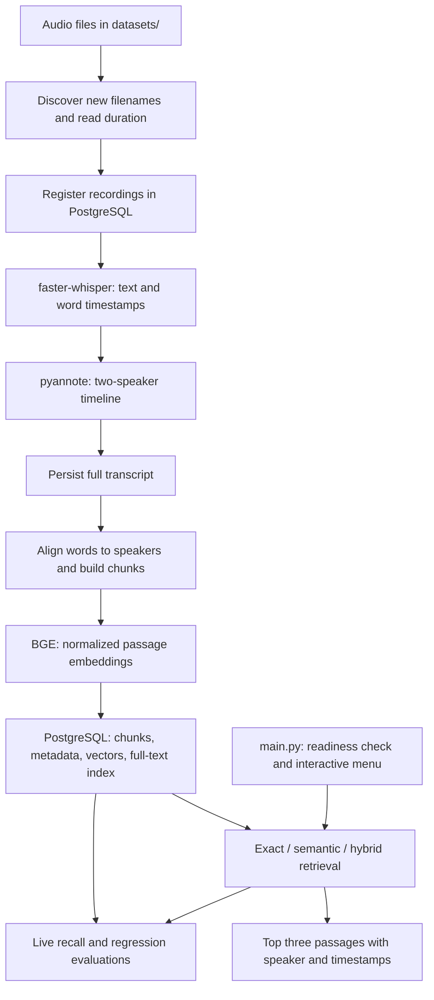

# Audio-Retrieval Pipeline — Technical Submission

## 1. Project overview

This local-inference based RAG pipeline turns podcast audio into searchable, speaker-attributed passages. A user can find an exact phrase, search by meaning, or combine lexical and semantic retrieval. Each result includes the recording, transcript text, speaker, and time range needed to locate the original audio.

The project was developed for a CPU-only environment without a GPU. Its central evaluation objective is to **detect when retrieval behaves incorrectly**, alongside measuring how much relevant evidence it retrieves. The implementation combines local audio processing, PostgreSQL/pgvector search, and automated quality and regression checks.

| Submission at a glance | Result |
| --- | --- |
| Evaluated corpus | Six recordings, 113 transcript chunks |
| Answerable evaluation set | 20 queries: seven factual, seven paraphrase, six topic queries |
| Semantic and hybrid mean Recall@3 | **0.825** in each mode |
| Semantic and hybrid mean Recall@5 | **0.925** in each mode |
| Synthetic fault detection | **6/6** expected failures detected; **0/6** clean-control false alarms |
| Unanswerable-query analysis | At a zero-false-alarm operating point on this sample, **8/12** unanswerable queries detected |
| Current lightweight test run | **79 passed; two live evaluation tests skipped** |

The retrieval scores and negative-query analysis come from the saved live evaluation on **26 September 2026, 10:49:49 UTC**. They are distinct from the fresh lightweight test run. Labels were curated with Codex and still require independent human review.

### Reading guide

- [Architecture](#2-architecture)
- [Transcription choices](#3-transcription-choices)
- [Diarization and word alignment](#4-diarization-and-word-alignment)
- [Chunking](#5-chunking)
- [Embeddings](#6-embeddings)
- [Database and migrations](#7-database-and-migrations)
- [Ingestion orchestration and idempotency](#8-ingestion-orchestration-and-idempotency)
- [Retrieval](#9-retrieval)
- [Evaluation methodology and results](#10-evaluation-methodology-and-results)
- [Reproduction](#11-reproduction)
- [Development history and evidence](#12-development-history-and-evidence)

## 2. Architecture

Ingestion performs the expensive audio work ahead of time. Interactive retrieval searches stored text and vectors; it does not transcribe or diarize audio again.



| Layer | Responsibility | Main implementation |
| --- | --- | --- |
| Configuration | Model names, devices, database URL, chunk target | [app/config.py](app/config.py) |
| Audio services | Duration, transcription, diarization, chunking, embedding | [app/services/](app/services/) |
| Persistence | SQLAlchemy entities and focused database operations | [app/models/](app/models/), [app/repositories/](app/repositories/) |
| Ingestion orchestration | File discovery, processing order, commits, progress | [init-data.py](app/scripts/init-data.py) |
| Retrieval | Query embedding, candidate retrieval, fusion | [retrieval.py](app/services/retrieval.py), [search.py](app/repositories/search.py) |
| User interface | Readiness check, menu, result formatting | [main.py](app/main.py) |
| Evaluation | Labels, metrics, baseline gates, fault injection, score analysis | [evals/](evals/) |

There is no answer-generation model in the application: its output is retrieved evidence from the stored transcripts.

## 3. Transcription choices

### faster-whisper, CPU inference, and int8

The implementation uses `faster-whisper` rather than the reference `openai-whisper` package. It runs Whisper through CTranslate2, which supports optimized inference and 8-bit quantization on CPUs. The upstream project reports lower CPU runtime and memory use for its int8 configuration. These are upstream observations, not timing measurements from this project. See the [faster-whisper documentation and benchmarks](https://github.com/SYSTRAN/faster-whisper#benchmark).

The project's defaults are `WHISPER_MODEL=small`, `WHISPER_DEVICE=cpu`, and `WHISPER_COMPUTE=int8`. With no GPU available, the intent is to keep transcription practical in time and memory while retaining a useful pretrained speech model. No local comparison of model sizes, quantization accuracy, or transcription throughput was performed.

### Decoding settings

| Setting | Implementation and purpose |
| --- | --- |
| `vad_filter=True` | Enables voice activity filtering so decoding focuses on speech. The intended benefit is less work on silence and fewer opportunities to invent text during non-speech intervals; it is not a guarantee against transcription errors. |
| `beam_size=5` | Maintains multiple decoding hypotheses rather than choosing only the locally best continuation. Five was explicitly requested as a quality/runtime compromise; its benefit was not separately benchmarked here. |
| `word_timestamps=True` | Provides the word-level time intervals needed to align transcript words with speaker turns. |

The library documents [VAD and word timestamp support](https://github.com/SYSTRAN/faster-whisper#usage). In [transcription.py](app/services/transcription.py), `generate_segments()` returns Whisper's segment generator. Ingestion materializes it once into a list so the same transcription can supply both the full transcript and the chunking step. The Whisper model is instantiated per recording; it is not currently cached across files.

## 4. Diarization and word alignment

Transcription supplies the words and their times. A separate service determines who spoke when, using `pyannote/speaker-diarization-community-1` on CPU. The model supports a fixed speaker count and an exclusive speaker timeline designed to simplify reconciliation with transcription timestamps. Its gated download requires accepted model conditions and an authorized Hugging Face token. See the [model card](https://huggingface.co/pyannote/speaker-diarization-community-1).

### Processing steps

1. Decode the audio with `torchaudio.load()` into an in-memory waveform and sample rate.
2. Load the diarization pipeline once per process and reuse it through a cache.
3. Run with `num_speakers=2`, reflecting the explicit assumption that every supplied clip has exactly two speakers.
4. Read `exclusive_speaker_diarization`, sort the turns, and require exactly two detected speaker labels.
5. Normalize labels by first appearance to `SPEAKER_01` and `SPEAKER_02`.

These labels are local to each recording. They do not identify people by name or establish that `SPEAKER_01` is the same person across recordings. Fixing the speaker count constrains the task; no CPU-time saving from this setting was measured.

The waveform input was a concrete debugging fix. Direct file processing encountered an MP3 seek/sample-count mismatch during diarization. Commit `ad8a2be` changed the service to fully decode the audio before passing it to pyannote, avoiding that failing file-seeking path. This trades additional waveform memory for more reliable input handling.

### Why word timestamps matter

A Whisper segment can span a speaker change. Assigning one speaker to the whole segment would mix speakers or misattribute part of the speech. The chunker instead assigns each timestamped word to the diarization turn with the greatest temporal overlap. If no turn overlaps, it uses the nearest turn, with earlier turns winning distance ties.

This produces a single speaker assignment per word, enabling chunks to split at speaker changes. The nearest-turn fallback has no maximum-distance or confidence threshold, so an assignment can still be uncertain. The exclusive timeline also does not preserve simultaneous overlapping speakers as multiple labels on one word.

Implementation: [diarization.py](app/services/diarization.py) and [chunking.py](app/services/chunking.py).

## 5. Chunking

Whisper's native segments are decoding and timing units. Using each as a retrieval passage can leave too little context, while embedding an entire recording makes it difficult to return a focused passage with useful timestamps. The project therefore aggregates speech into bounded, speaker-aware chunks.

### Current algorithm

| Rule | Behavior | Purpose |
| --- | --- | --- |
| Target size | Approximately 200 whitespace-counted words, configurable through `CHUNK_TARGET_WORDS` | Balance local context against passage specificity |
| Speaker change | End the current chunk before the new speaker's word | Keep one speaker per chunk |
| Long pause | Split when the next word starts at least 2.5 seconds after the previous word ends | Avoid joining speech across a substantial silence |
| Size boundary | Once the current chunk reaches the target, flush it before adding the next word | Bound passage length without an additional model |
| Overlap | Carry approximately the last 30 words forward after a size-only split | Preserve context near an otherwise arbitrary boundary |
| Speaker/pause boundary | Carry no overlap across the boundary | Avoid mixing speakers or reconnecting passages separated by silence |
| Metadata | First word's start, last word's end, joined text, speaker | Preserve a direct path back to the audio |

The repeated words count toward the next chunk's target. Short speaker turns can therefore produce chunks much smaller than 200 words. Overlapping chunks remain separate retrievable records and can both be relevant to an evaluation query.

### Why this design

The initial implementation aggregated Whisper segments. Adding diarization changed the unit of alignment to individual words so speaker boundaries could be respected. A deterministic algorithm keeps the processing path simple and the relationship between text and timestamps inspectable.

Embedding-based semantic boundary detection was considered in the Codex discussions but was not implemented. It would introduce additional processing and tuning before there was evidence that it was needed. The final code also does **not** implement sentence-boundary detection, topic-change detection, or a token-aware limit; those should not be inferred from early design suggestions.

The overlap is a practical context-preservation choice, not a measured optimum. There is no ablation establishing that 200 words, 30-word overlap, or the 2.5-second pause threshold gives the best recall on this corpus.

## 6. Embeddings

The committed model is **`BAAI/bge-base-en-v1.5`**, loaded through Sentence Transformers. It is an English retrieval embedding model with 768-dimensional output and a 512-token input limit. The model card recommends a retrieval instruction for short queries and no instruction for passages. See the [BGE model card](https://huggingface.co/BAAI/bge-base-en-v1.5).

The technical rationale is a practical middle ground: a local base-sized encoder for English passages, with vectors that fit the chosen `vector(768)` schema. This is a suitability argument, not an experimentally demonstrated win over MiniLM, BGE-small, or BGE-large. Although an early chat mentioned MiniLM, the first committed embedding service already used BGE-base; the measured results in this submission are for BGE-base.

In [embedding.py](app/services/embedding.py):

- Passage text is encoded in batches of 32 with normalized embeddings.
- Chunk dictionaries retain their text, speaker, and timestamps when vectors are added.
- Queries use the prefix `Represent this sentence for searching relevant passages: ` and are normalized too.
- Query vectors must have 768 dimensions, matching the database schema.
- The model is cached once per process and reused across interactive queries.

Ingestion and retrieval must use the same embedding model. Matching vector dimensions alone does not establish compatible vector spaces. The service lets Sentence Transformers select the device; the explicit int8 setting applies to Whisper, not BGE or pyannote.

The 200-word chunk target is not a 512-token guarantee: unusual text can exceed the model's input window and be truncated during encoding. This is a current limitation of word-count-based chunking.

## 7. Database and migrations

PostgreSQL stores source metadata, full transcripts, lexical search data, and vectors together. pgvector provides semantic distance operations without introducing a separate vector database, while ordinary joins preserve recording provenance.

| Table | Important fields | Role |
| --- | --- | --- |
| `recordings` | UUID, filename, duration in seconds, creation time | Source audio metadata |
| `transcripts` | UUID, recording foreign key, full text | Complete transcription for a recording |
| `chunks` | UUID, recording foreign key, start/end seconds, text, speaker, `vector(768)`, generated `tsvector` | Searchable evidence and retrieval metadata |

SQLAlchemy defines the entities and database operations; psycopg is the PostgreSQL driver. Repository methods implement the operations actually needed by ingestion and retrieval rather than generating unused CRUD methods. The ingestion script owns its connection and commits. Connection helpers live in [postgres.py](app/services/postgres.py).

### Why Alembic

The database evolved in three explicit revisions:

| Revision | Change |
| --- | --- |
| `20260926_01` | Enable pgvector and create recordings, transcripts, and chunks |
| `20260926_02` | Add the required chunk speaker field |
| `20260926_03` | Add the generated English full-text search column and GIN index |

Alembic makes these changes ordered and versioned. `alembic upgrade head` applies pending revisions; schema creation is not mixed into application startup or ingestion. Following the user's direction, duplicated schema SQL and the runtime `init_db()` method were removed. Migrations use SQLAlchemy/Alembic operations, with raw SQL where necessary to create the PostgreSQL extension. Alembic imports the same connection helpers as the application.

Migration versioning is separate from ingestion idempotency. For a fresh setup, apply all migrations before ingesting. The speaker migration adds a non-null column without a backfill, so upgrading a database with older populated chunks needs an explicit data-migration plan. The initial downgrade preserves tables, but later downgrades remove their added fields; there is no blanket guarantee that every downgrade preserves all data.

## 8. Ingestion orchestration and idempotency

[init-data.py](app/scripts/init-data.py) provides a sequential, progress-reporting ingestion workflow:

1. Resolve `datasets/` from the repository root and discover its regular files in sorted order. There is no hardcoded dataset list or file-extension filter.
2. Open one database connection and fetch existing recording filenames.
3. Keep only files whose names are not already registered.
4. For each new file, inspect its duration with PyAV, insert its recording row, and commit. All new recordings are registered before audio processing begins.
5. Process each new recording: materialize its transcription, run diarization, assemble the full transcript, and insert and commit that transcript.
6. Align words to speaker turns, create chunks, generate embeddings, and insert and commit that recording's chunks.
7. Print completion/progress messages and close the connection in a `finally` block. If no chunks are produced, skip embedding for that recording.

Duration comes from container metadata, with an audio-stream metadata fallback. It does not require a full decoding pass solely to calculate duration; unavailable metadata produces `None`.

### What “idempotent” means here

After successful ingestion, rerunning the script skips the same filenames, avoiding duplicate processing and storage in a normal sequential run. Adding a new file processes only that new filename.

This is **filename-based duplicate prevention**, with specific limits:

- Recording rows are committed before processing. A failure can leave registered recordings without transcripts or chunks, and a rerun will still skip them.
- Replacing the contents of an existing filename does not trigger reingestion.
- Filename uniqueness is not enforced by a database constraint, so concurrent ingestion runs are not protected against duplicate registration.
- There is no automatic retry state, content hash, or resumable per-stage status.

These limits matter to failure detection: the startup pre-check only verifies that at least one chunk exists. It does not prove every recording completed ingestion.

## 9. Retrieval

### Interactive workflow

`python -m app.main` first checks for seeded chunks. If none exist, startup reports that ingestion is pending and directs the user to `init-data.py`. Otherwise the loop is:

**Select mode → enter query → retrieve → display up to three results → return to menu.**

The interface supports Hybrid, Exact phrase, and Semantic modes. Results show filename, recording ID, speaker, formatted start/end timestamps, and transcript text. Blank queries are rejected, retrieval exceptions are displayed, and exit, end-of-input, and Ctrl+C are handled.

### Search modes

| Mode | Mechanism | Intended use |
| --- | --- | --- |
| Exact phrase | Escaped, parameterized PostgreSQL case-insensitive regular expression | Find a contiguous phrase in the stored transcript |
| Semantic | BGE query embedding and pgvector cosine distance | Find related meaning despite different wording |
| Hybrid | English full-text candidates plus semantic candidates, combined by rank | Use both word evidence and semantic similarity |

**Exact phrase search** ignores case and whitespace differences, preserves punctuation and word forms, and avoids matching inside larger words. It does not load the embedding model. Matches are ordered by recording ID, start time, and chunk ID. Matching is within a stored chunk, so an exact phrase spanning a chunk boundary is not guaranteed to match.

**Semantic search** excludes null embeddings and ranks by `embedding <=> query_vector`, with similarity reported as `1 - cosine_distance`. The current database has no approximate vector index; it performs exact vector-distance retrieval over the small corpus. Here, “exact” nearest-neighbor computation is separate from the Exact phrase menu option.

**Hybrid lexical retrieval** uses `plainto_tsquery('english', query)`, a stored generated `to_tsvector('english', text)` column, a GIN index, and `ts_rank_cd` ranking. This branch uses linguistic normalization/stemming rather than literal phrase matching. The generated column covers both existing rows when migrated and future text inserts or updates.

### Rank fusion

Semantic and hybrid search fetch up to `max(50, requested_limit)` candidates per active branch. Hybrid search merges candidates by chunk ID and applies equal-weight reciprocal rank fusion:

```text
score(chunk) = sum over branches containing the chunk of 1 / (60 + branch_rank)
```

Using rank positions avoids adding lexical scores and cosine similarities as if they shared a scale. A chunk appearing in both lists receives contributions from both. A missing branch contributes zero; ties use chunk ID. Distinct overlapping chunks are retained.

The public search function defaults to three results. Evaluation requests five and scores prefixes of that same ranked list. Returned diagnostics include branch ranks, cosine similarity, and fusion score, though the CLI focuses on evidence and provenance.

There is no reranker, relevance cutoff, or automatic abstention policy. Semantic and hybrid modes can return topically related passages even when the requested fact is absent. Fusion scores are ranking values, not probabilities of correctness.

## 10. Evaluation methodology and results

### 10.1 Dataset and metric

The fixed evaluation corpus contains 113 chunks across `output_1.mp3` through `output_6.mp3`. Codex read the exported database content and curated 20 answerable queries with relevant chunk UUIDs and relevance rationales. These are initial assistant-curated judgments, not independently validated ground truth.

For each query and each search mode:

```text
Recall@k = distinct labeled relevant chunks retrieved in the first k results
           / total labeled relevant chunks for that query
```

Scores are averaged equally across queries. A query with two relevant chunks can score at most 0.5 at k=1. Duplicating a retrieved ID does not increase recall. Overlapping chunks are included in labels when they independently contain relevant evidence.

The live evaluator runs each answerable query once per mode with `limit=5` and measures Recall@1, Recall@3, and Recall@5 from the resulting prefixes. It evaluates semantic and hybrid retrieval; Exact phrase mode is outside these recall measurements.

### 10.2 Measured retrieval results

| Mode | Mean Recall@1 | Mean Recall@3 | Mean Recall@5 | Baseline Recall@3 delta | Quality gates |
| --- | ---: | ---: | ---: | ---: | --- |
| Semantic | 0.575 | 0.825 | 0.925 | 0.000 | Pass |
| Hybrid | 0.575 | 0.825 | 0.925 | 0.000 | Pass |

The saved expanded live report has `status: success`, with no new zero-hit queries and no Recall@3 regression in either mode. The retained [baseline](evals/baseline.json) also records the initial scores.

**Interpretation:** the top three results retrieve 82.5% of labeled relevant chunks on average across this query set; the top five retrieve 92.5%. These are chunk-level recall figures, not percentages of perfectly answered questions or measurements of transcription accuracy. Hybrid search shows no recall improvement over semantic search on this set; identical aggregate scores also do not imply identical rankings.

The report preserves concrete misses:

- **q13:** no relevant result in the top three in either mode. The query asks which advances in phones and augmented reality enabled Toasterpets' cartoon creation technology.
- **q14, q18, q19:** each retrieves only one of two labeled relevant chunks at k=5. They concern customer recovery after a furniture acquisition, scalable coaching business models, and the platform used to find a first coaching client.

These misses remain visible even though the aggregate thresholds pass.

### 10.3 Quality gates and regression detection

Each mode must independently satisfy:

1. Mean Recall@3 ≥ 0.80 and mean Recall@5 ≥ 0.80.
2. No decrease in mean Recall@3 relative to the saved baseline, allowing only `1e-12` numerical tolerance.
3. No newly zero-hit query in the top three compared with the baseline.

Recall@3 matters because the actual UI displays three results: an item falling from rank three to four can hurt users while leaving Recall@5 unchanged. The zero-hit check catches complete query failures even when gains elsewhere compensate in the average. Partial per-query regressions are reported, but do not independently fail the suite if the other gates still pass.

The baseline is never updated automatically. Comparisons require matching answerable-query and corpus fingerprints and the embedding model name. Stale or missing relevant IDs, missing embeddings for labeled chunks, malformed labels, baseline mismatches, and retrieval exceptions cause explicit errors.

Reports first record `running`, then `success`, `failed`, or `error`, preventing a failed evaluation from silently leaving an older success as the apparent latest result. A process stopped mid-run can leave `running`; this is not a pass.

### 10.4 Testing the detector with known failures

The fault suite substitutes deterministic database/model responses at candidate-retrieval boundaries while exercising the real search orchestration, rank fusion, metrics, and gates. It uses a synthetic corpus rather than modifying the real database.

| Injected failure | What should catch it | Saved outcome |
| --- | --- | --- |
| Displace relevant semantic candidates | Semantic Recall@3 baseline regression | Detected |
| Remove one recording's candidates | New hybrid zero-hit query at k=3 | Detected |
| Disable lexical retrieval | New hybrid zero-hit query on a lexical-dependent fixture | Detected |
| Move relevant evidence from rank three to four | Recall@3 regression while Recall@5 remains perfect | Detected |
| Remove a labeled chunk's embedding | Explicit validation error | Detected |
| Raise a retrieval outage | Query/mode-specific error preserving the expected underlying cause | Detected |

**Result: six detected faults, zero missed faults, and zero false alarms across six matched clean controls.** An unrelated crash does not count as detection: the expected gate or error must occur.

This establishes synthetic detector coverage for the listed scenarios. It does not establish a production detection rate, execute the SQL paths, or prove the real embedding model behaves correctly under arbitrary corruption.

### 10.5 Unanswerable queries and misleading near-matches

A separate set contains 12 queries: six unrelated topics and six plausible questions about facts absent from otherwise relevant recordings. These negatives are excluded from recall denominators.

The diagnostic is the highest semantic cosine similarity. The evaluator sweeps thresholds using `score < threshold` as a weak-evidence flag, reporting detection and false-alarm counts. It does not select a production cutoff or change interactive search behavior.

At the best observed detection point with **zero false alarms among the 20 answerable queries**:

| Negative category | Detected | Missed | Detection rate |
| --- | ---: | ---: | ---: |
| Unrelated topics | 6/6 | 0 | 100% |
| Plausible missing facts / near-matches | 2/6 | 4 | 33.3% |
| Combined | 8/12 | 4 | 66.7% |

The corresponding observed threshold is approximately 0.5480. This is a descriptive operating point from the same small sample, not a calibrated threshold or held-out accuracy claim. Empty semantic results and invalid similarity scores are treated as errors, not successful abstention.

The key finding is that semantic similarity distinguishes unrelated topics more easily than absent facts within a related topic. Four near-matches remain above the threshold: a passage can look relevant without answering the question. A passing recall suite therefore does not establish reliable no-answer detection.

### 10.6 What the evaluation establishes—and its limits

The evidence supports useful retrieval on the fixed labeled corpus, stable Recall@3 against a baseline, and detection of six deliberately introduced failures. It also exposes existing misses and the limits of similarity-only answerability checks.

The following remain unmeasured or uncovered:

| Area | Current boundary |
| --- | --- |
| Audio accuracy | No reference-audio word error rate, diarization error rate, or timestamp-accuracy evaluation |
| Metadata correctness | No injected timestamp-corruption or speaker-misattribution checks |
| Generalization | Small assistant-curated query sets; no independent human validation or held-out detector calibration |
| Embedding provenance | Fingerprints cover chunk IDs/text and model name, not stored vector contents, model revision, or the model that originally generated them |
| Ingestion recovery | Filename skipping can hide partially processed recordings; readiness only checks for any chunk |
| Search quality beyond recall | No measured precision, answer-generation accuracy, or production abstention performance |
| Runtime and scale | No project-specific throughput, latency, memory benchmark, or large-corpus load test |

This makes the system's assessment inspectable: a high aggregate score is accompanied by explicit regression rules, known counterexamples, and documented blind spots.

## 11. Reproduction

Follow [README.md](README.md) for prerequisites, database setup, environment variables, and model access. PostgreSQL needs pgvector; the documented Docker option is `pgvector/pgvector:pg17`. Configure `DATABASE_URL` and an `HF_TOKEN` whose account has accepted the pyannote model conditions.

From the repository root, in the configured Python environment:

| Step | Command | Purpose |
| --- | --- | --- |
| Install dependencies | `python -m pip install -r requirements.txt` | Install application and evaluation packages |
| Apply schema | `alembic upgrade head` | Apply the three revisions before ingestion |
| Ingest audio | `python app/scripts/init-data.py` | Register, transcribe, diarize, chunk, embed, and persist new files |
| Start search | `python -m app.main` | Enter the interactive interface |
| Lightweight tests | `python -m pytest` | Run unit and synthetic detector tests; skip live evaluations |
| Fault report | `python -m evals.faults` | Generate `evals/reports/faults.json` |
| Export labeling corpus | `python -m evals.runner --export-catalog evals/catalog.json` | Export current chunks and provenance |
| Live evaluation | `python -m pytest evals/ --run-evals -m eval -s` | Run recall, baseline gates, and unanswerable-query analysis |

**Reproducing the exact saved scores requires the original database snapshot.** Fresh ingestion creates new chunk UUIDs, invalidating the committed labels and baseline even if the audio is unchanged. For a newly ingested corpus, export it, review and remap labels, and deliberately establish a compatible baseline using [evals/README.md](evals/README.md). Do not replace the baseline merely to make a regression pass.

Runtime reports under `evals/reports/` are Git-ignored. The score tables here were checked against the locally saved reports; those report files may not be present in a fresh clone. The committed baseline, labels, and catalog provide the retained evaluation context. Dependencies are not fully version-locked, so a database snapshot and environment capture are needed for stronger reproducibility.
